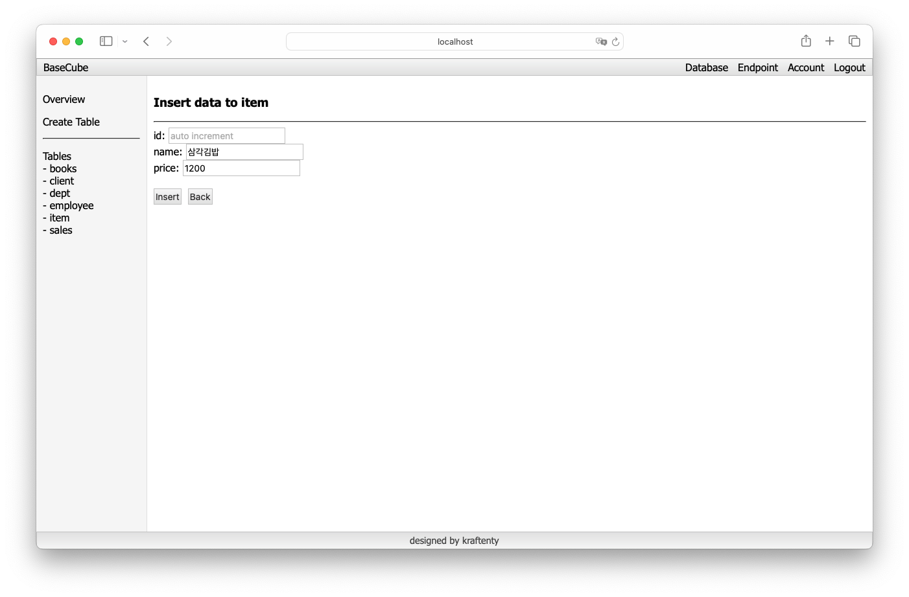

# BaseCube
> BaseCube - Node.js로 만든 BaaS (Backend as a Service)

## 목차
1. [프로젝트 소개](#프로젝트-소개)
2. [주요 기능](#주요-기능)
3. [스크린샷](#스크린샷)

## 프로젝트 소개
BaseCube는 Node.js 기반의 Backend as a Service(BaaS) 플랫폼입니다. 개발자들이 백엔드 인프라 구축에 들이는 시간을 줄이고, 핵심 비즈니스 로직 개발에 집중할 수 있도록 도와줍니다.

## 주요 기능
- 사용자별 데이터베이스 (table) 생성 및 관리
    * 테이블 생성
        * Primary Key, Auto Increment, Not Empty 제약조건 지원
        * 원하는 만큼 Column 추가 가능
    * 테이블 전체 조회
    * 테이블 row 단위 수정
    * 테이블 삭제
- 사용자별 API 엔드포인트 생성 및 관리
    * 엔드포인트는 테이블을 생성하면 자동 생성
    * 엔드포인트 On/Off 기능
    * UID 및 API KEY 기반 인증
        * URL에 UID를 포함해야 함
        * HTTP 요청 헤더에 API KEY를 포함해야 함
    * REST API 방식 요청 지원
        > ```
        > GET /api/[uid]/[table_name] : 테이블 전체 조회
        > GET /api/[uid]/[table_name]/[primary_key] : 단건 조회
        > POST /api/[uid]/[table_name] : row 추가
        > PUT /api/[uid]/[table_name]/[primary_key] : row 수정
        > DELETE /api/[uid]/[table_name]/[primary_key] : row 삭제
        > ```
    * DML Query 방식 지원
        * DML Query방식으로 요청을 보낼 때는 GET 메소드를 사용함
        * 각 절은 세미콜론으로 구분되며, 각 단어는 대쉬로 구분됨
        * table_name에는 테이블 이름이 올 수 있음
        * operator에는 =, !=, >, >=, <, <= 중 하나가 올 수 있음
        * where절과 value 절은 and로 조건을 추가할 수 있음
        > ```
        > GET /api/[uid]/select;from-[table_name] : 테이블 전체 조회
        > GET /api/[uid]/select;from-[table_name];where-[attribute]-[operator]-[value][-and...] : where절 조건에 따른 조회
        > GET /api/[uid]/insert;from-[table_name];value-[attribute]-=-[value][-and...] : row 추가
        > GET /api/[uid]/update;from-[table_name];set-[attribute]-=-[value];where-[attribute]-[operator]-[value][-and...] : row 수정
        > GET /api/[uid]/delete;from-[table_name];where-[attribute]-[operator]-[value][-and...] : row 삭제
        > ```
## 스크린샷
### 로그인 화면

> 로그인 화면입니다. 로그인과 회원가입을 할 수 있습니다.

### 메인 화면

> 로그인 후 메인 화면입니다. 서비스의 주요 기능, 도움말, 문의하기 등을 확인할 수 있습니다.

### 데이터베이스 개요 화면

> 데이터베이스 개요 화면입니다. 자신의 요금제에 할당된 테이블 사용량과 테이블 목록을 볼 수 있습니다.

### 테이블 생성 화면

> 테이블을 생성하는 화면입니다. 컬럼을 추가하고 제약조건을 설정할 수 있습니다.

### 데이터 추가 화면

> 테이블에 새로운 데이터를 추가하는 화면입니다.

### 테이블 조회 화면

> 테이블의 데이터를 조회하는 화면입니다.

### 엔드포인트 개요 화면

> 자신의 API Key와 UID를 확인할 수 있는 화면입니다.

### 엔드포인트 상세 화면

> 엔드포인트의 상세 정보 및 사용 예시를 확인할 수 있는 화면입니다. 엔드포인트 사용을 On/Off 할 수 있습니다.

### 요금제(Plan) 화면

> 사용 가능한 요금제 목록을 확인하고 결제할 수 있는 화면입니다. [실제 결제 기능은 미완성]


---
